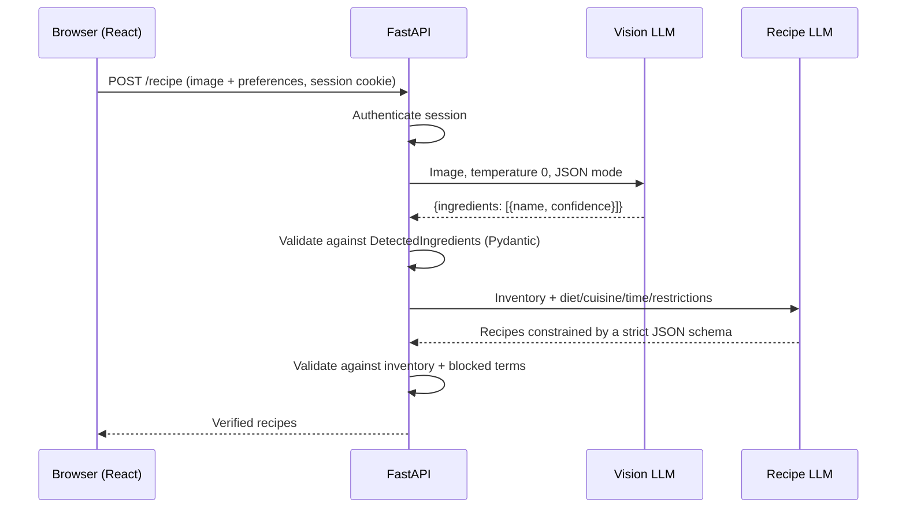

# PantryChef

**Photo of your ingredients in, validated recipes out.** A full-stack app that treats LLM output as untrusted input and verifies it on the server before the user sees it.

[Live demo](https://pentry-ch.netlify.app/) · [API docs](#api) · [Security model](#security-model) · [Test it](#security-testing)

> The backend is on a free tier, so the first request after idle can take 30-60 s while it cold-starts.

<!-- TODO: add a 10-15 s GIF or 2-3 screenshots here: upload -> detected ingredients -> recipe.
      -->

---

## The problem

Most "AI recipe" apps take a dish name and let a model improvise. Nothing stops the model from calling for ingredients you don't own, or, worse, ignoring an allergy you declared.

PantryChef inverts the flow: the user's **actual inventory** is the input, and the model's output is checked against it afterwards.

## How it works



Three stages, each with a different trust level:

1. **Detection.** A vision model lists visible ingredients with confidence scores. The prompt is biased toward false negatives (it's better to miss a lemon than to invent one), and the response must parse into a Pydantic model or the request fails.
2. **Generation.** A second call receives only the detected inventory plus preferences. Output is constrained with `response_format: json_schema` (`strict: true`), generated directly from the Pydantic `RecipeResponse` model so the schema and the validator can't drift apart.
3. **Verification.** `validate_recipes()` checks the parsed result against the detected inventory and the user's blocked terms (`parse_blocked(allergies, avoid)`). The model is a proposer; the server decides what gets returned.

<!-- TODO: add 3-5 lines on what validate_recipes() actually does (matching strategy, how pantry
     staples are handled, what happens on failure: reject / retry / strip). This is the core of the
     project; it deserves a concrete example. -->

## Design decisions

| Decision | Why |
|---|---|
| Two LLM calls instead of one | Detection and generation fail differently. Splitting them makes each step testable and lets the inventory become an explicit, inspectable data structure. |
| Temperature 0 for detection, 0.2 for generation | Detection should be deterministic; generation gets just enough variety. |
| Schema derived from Pydantic models | One source of truth for the model's output contract and the server's validation. |
| Server-side sessions (opaque 256-bit token in the DB) instead of JWTs | Sessions can be revoked instantly on logout and expire server-side; nothing sensitive lives in the token. |
| `HttpOnly` cookie, `Secure` + `SameSite=None` in production | The token is unreachable from JavaScript. `None` is required because frontend and API are on different sites (Netlify / Render). |
| Argon2 password hashing (`argon2-cffi`) | Memory-hard, current best practice. |
| Every saved-recipe query is scoped by `user_id` from the session | The client never supplies the owner, which removes the usual IDOR path. |
| CORS pinned to a single configured origin with credentials | No wildcard origins alongside cookies. |

## Stack

| Layer | Tech |
|---|---|
| Frontend | React, Vite (Netlify) |
| Backend | Python, FastAPI, Pydantic, SQLAlchemy (async) (Render) |
| Database | PostgreSQL |
| AI | Groq API, Qwen models (vision + text) |
| Tooling | uv |

## API

Interactive docs are served at `/docs` (Swagger UI) when running locally.

| Method | Path | Auth | Description |
|---|---|---|---|
| `POST` | `/auth/register` | no | Create account (JSON: email, password) |
| `POST` | `/auth/login` | no | Start session, sets `session_id` cookie (form data) |
| `GET` | `/auth/me` | cookie | Current user |
| `POST` | `/auth/logout` | cookie | Delete session server-side, clear cookie |
| `POST` | `/recipe` | cookie | Multipart: `image`, `diet`, `cuisine`, `allergies`, `avoid`, `max_cooking_time` |
| `POST` | `/recipes/save` | cookie | Save a recipe |
| `GET` | `/recipes/saved` | cookie | List the current user's saved recipes |
| `DELETE` | `/recipes/saved/{id}` | cookie | Delete one of the current user's recipes |
| `GET` | `/health` | no | Liveness check |

## Run locally

**Requirements:** Python (see `.python-version`), [uv](https://docs.astral.sh/uv/), Node.js, PostgreSQL, a [Groq API key](https://console.groq.com/).

```bash
git clone https://github.com/nawaz-builds/pantry-chef.git
cd pantry-chef

# Backend
cp .env.example .env        # then fill in the values below
uv sync
uv run python main.py       # API on the configured port; docs at /docs

# Frontend (second terminal)
cd frontend
npm install
npm run dev                 # Vite dev server on http://localhost:5173
```

| Variable | Purpose |
|---|---|
| `DATABASE_URL` | Async SQLAlchemy URL for PostgreSQL |
| `GROQ_API_KEY` | Groq API key |
| `FRONTEND_URL` | Allowed CORS origin (default `http://localhost:5173`) |
| `ENVIRONMENT` | Set to `production` to enable `Secure` / `SameSite=None` cookies |

## Project structure

```
pantry-chef/
├── src/
│   └── app/
│       ├── __init__.py
│       ├── app.py          # FastAPI routes: auth, recipe pipeline, saved recipes
│       ├── prompts.py      # Prompts, validate_recipes(), parse_blocked()
│       ├── schemas.py      # Pydantic models (also generate the LLM JSON schema)
│       ├── database.py     # SQLAlchemy models (User, Session, SavedRecipe), async session
│       └── security.py     # Argon2 hash/verify
├── frontend/               # React + Vite client
│   ├── public/
│   ├── src/
│   │   ├── api.js          # API client (fetch wrapper, credentials: include)
│   │   ├── App.jsx
│   │   ├── login.jsx
│   │   ├── main.jsx
│   │   └── index.css
│   ├── index.html
│   ├── package.json
│   ├── vite.config.js
│   └── .env.example        # Frontend env (API base URL)
├── main.py                 # Backend entry point
├── test_db.py              # Database connectivity check
├── pyproject.toml          # Python dependencies (managed with uv)
├── uv.lock
├── .python-version
├── .env.example            # Backend env template
└── README.md
```

## Security model

**Threat model.** Untrusted users, an untrusted LLM, and untrusted image content. The assets are user accounts, saved recipes, and the LLM API quota.

**Implemented**
- Argon2 password hashing; opaque random session tokens stored server-side with expiry
- `HttpOnly` cookies; CORS restricted to one origin
- Ownership-scoped queries on saved recipes
- Schema-validated LLM input and output; server-side check of recipes against inventory and blocked terms

**Known limitations** (tracked openly; see the roadmap)
- No rate limiting on auth or on the LLM-backed `/recipe` endpoint
- No explicit CSRF defence beyond CORS (cross-site cookies are required by the deployment topology)
- Upload size and content type are not yet strictly enforced
- Text visible in an uploaded image reaches the vision model, so prompt injection via image is possible; the detection output is schema-validated but not content-filtered
- **Allergy handling is best-effort and not a medical safety guarantee.** Always check ingredients yourself.

## Roadmap

- [ ] Rate limiting (per-user and per-IP), upload size and magic-byte validation
- [ ] CSRF protection (Origin check or double-submit token)
- [ ] Return proper HTTP status codes (`401`/`404`) instead of `200` + `{"error": ...}`
- [ ] Extract session lookup into a single FastAPI dependency
- [ ] Non-blocking LLM calls (async Groq client or threadpool)
- [ ] Tests for `validate_recipes()` and for cross-user access on saved recipes
- [ ] CI (lint + tests)
- [ ] Evaluation set for ingredient detection accuracy

## Security testing

You may test the deployed app: auth, session handling, authorization (IDOR), input validation, and upload handling.

**Please don't:** run DoS or load tests, access or modify other users' data, or attack the hosting infrastructure (Render, Netlify, the database host). Use your own test accounts.

**Report** (via [GitHub issue](https://github.com/nawaz-builds/pantry-chef/issues) or `<contact email>`): what you found, steps to reproduce, expected vs. actual behaviour, and impact. This is a personal project, not a paid bounty, but good reports get credited here.

## License

<!-- TODO: add a LICENSE file (MIT is a common choice) and name it here. -->

Built by [Nawaz](https://github.com/nawaz-builds).